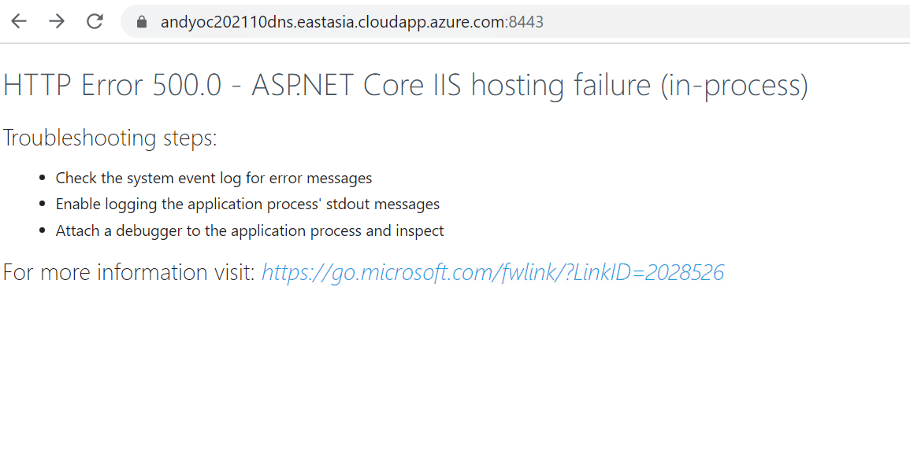
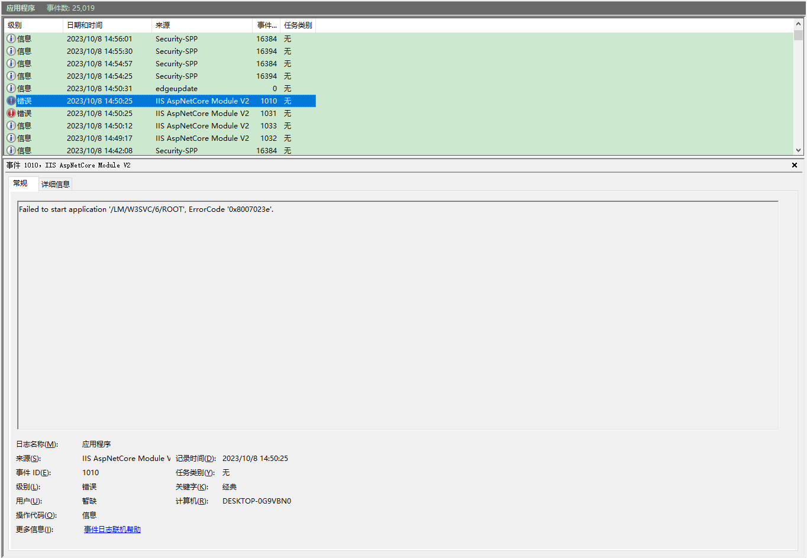
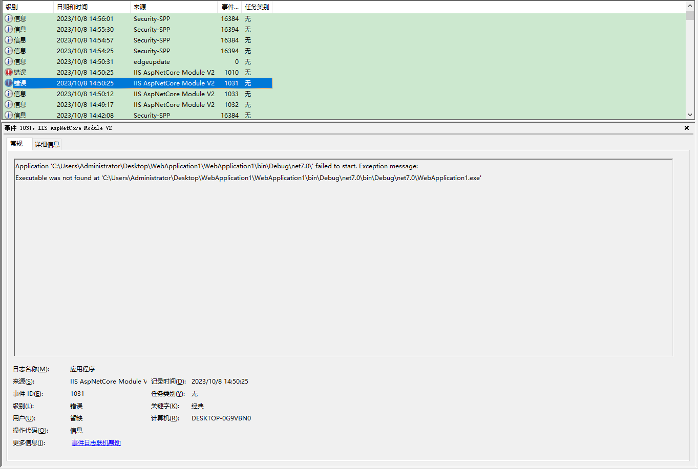
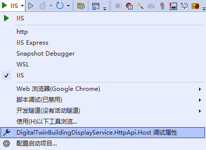
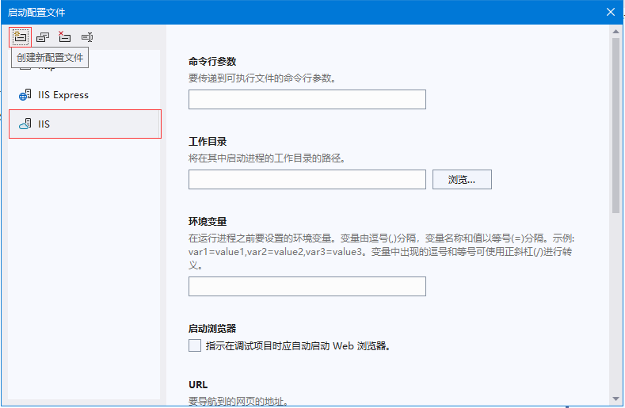

使用vs2022创建.net7 webapi项目，发布后，使用iis部署后访问报错。直接使用dotnet命令或双击exe程序启动则可以正常访问。

---

## 问题

使用vs2022创建.net7 webapi项目，发布后，使用iis部署后访问报错，已经设置了程序池为无托管代码、并安装了.NET7 托管捆绑包、重启了系统。
直接用浏览器访问只会显示503错误码，用vs2022附加vs调试则会显示下面的错误内容

查看系统日志可以看到如下错误：

## 解决

在vs调试属性中增加iis调试选项，参照IIS Express项目配置，也可以直接修改lauchSeeting.json文件，添加iis项

把应用url配置成iis中的绑定地址，启动vs调试。这是发现iis的地址可以正常访问，关闭vs后仍然能够访问。

至此问题消失。

## 原因

正在探索……

---

**参考资料**

- [对 Azure 应用服务和 IIS 上的 ASP.NET Core 进行故障排除](https://learn.microsoft.com/zh-cn/aspnet/core/test/troubleshoot-azure-iis?view=aspnetcore-7.0)
