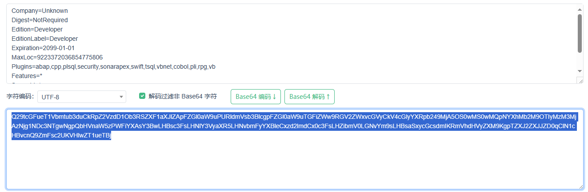

sonarqube-developer-9.9.3.79811测试通过

---

<div id="toc"></div>

## SonarQube

<a href="https://binaries.sonarsource.com/CommercialDistribution/sonarqube-developer/sonarqube-developer-9.9.3.79811.zip">软件版本: sonarqube-developer-9.9.3.79811</a>

<a href="https://download.oracle.com/java/17/latest/jdk-17_windows-x64_bin.exe">Java版本: jdk17</a>

<a href="/static/posts/2023/2023-12-19-SonarQube破解-SonarQubeAgent-1.2-SNAPSHOT.jar" target="_blank">Agent版本: 1.2</a>

## 生成lincese

使用说明:
把下列信息全部复制,然后base64加密后的内容就是license,注意要包括换行

```txt
Company=Unknown
Digest=NotRequired
Edition=Developer
EditionLabel=Developer
Expiration=2099-01-01
MaxLoc=9223372036854775806
Plugins=abap,cpp,plsql,security,sonarapex,swift,tsql,vbnet,cobol,pli,rpg,vb
Features=*
ServerId=*
Support=false
Type=ny0c
```



<mark> 其中Developer可以根据版本修改,例如：Enterprise</mark>

## 修改sonar.properties

修改SonarQube启动参数,修改conf/sonar.properties的内容
其中,

```#sonar.web.javaOpts=-Xmx1G -Xms128m -XX:+HeapDumpOnOutOfMemoryError```

改成

```sonar.web.javaOpts=-javaagent:/你的agent目录/SonarQubeAgent-1.2-SNAPSHOT.jar -Xmx1G -Xms128m -XX:+HeapDumpOnOutOfMemoryError```

以及

```#sonar.ce.javaOpts=-Xmx2G -Xms128m -XX:+HeapDumpOnOutOfMemoryError```

改成

```sonar.ce.javaOpts=-javaagent:/你的agent目录/SonarQubeAgent-1.2-SNAPSHOT.jar -Xmx2G -Xms128m -XX:+HeapDumpOnOutOfMemoryError```

以上内容中`-Xms128m -XX:+HeapDumpOnOutOfMemoryError`因为sonarqube版本差异，可能存在内容不完全一致，但是`sonar.web.javaOpts=`应该是一致的

## 启动sonarqube

根据官方文档启动，如果你也是用的windows，则运行bin/windows-x86-64/StartSonar.bat

## 设置license

浏览器打开 http://sonarqube-IP地址:sonarqube-端口/ 设置或者登录sonarqube,然后点击最顶上的Administration选项卡,然后点击下面的Configuration,选择License Manager,填入第一步base64编码生成的license字符串即可


我这是已经添加后的界面

## 附件

<a href="/static/posts/2023/2023-12-19-SonarQube破解-SonarQubeAgent-1.2-SNAPSHOT.jar" target="_blank">SonarQubeAgent-1.2-SNAPSHOT.jar</a>

<a href="/static/posts/2023/2023-12-19-SonarQube破解-SonarQubeAgent-1.1-SNAPSHOT.jar" target="_blank">SonarQubeAgent-1.1-SNAPSHOT.jar</a>

<a href="/static/posts/2023/2023-12-19-SonarQube破解-SonarQubeAgent-1.2-src.zip" target="_blank">SonarQubeAgent-1.2-src.zip</a>

---

**参考资料**

- [[原创] SonarQube 破解 ](https://bbs.kanxue.com/thread-273289-1.htm)
